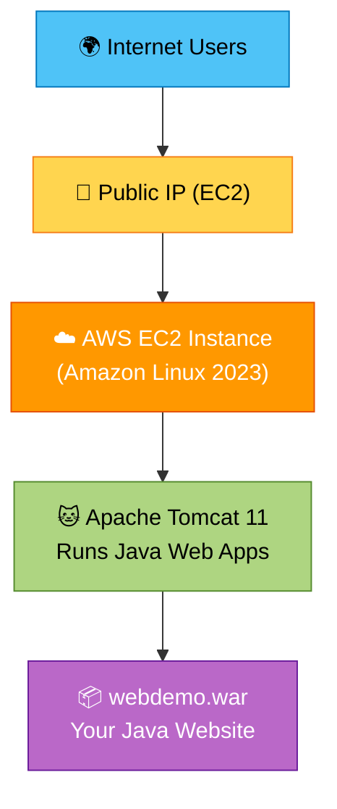

<div align="center">

# 🚀 Deploying a Java Web App on AWS EC2 with Tomcat 11

### ✨ A friendly, visual guide by Jojo Novoa


</div>

---

## 🗺️ Table of Contents

> Click any section to jump straight to it 👇

1. [📖 Overview](#-1-overview)
2. [🏗️ Architecture Diagram](#️-2-architecture-diagram)
3. [📋 Requirements](#-3-requirements)
4. [🛠️ Step‑by‑Step Guide](#️-4-step-by-step-deployment-guide)
5. [🚑 Troubleshooting](#-5-troubleshooting)
6. [🧠 Real‑World Notes](#-6-real-world-notes-from-team-debugging)
7. [✅ Final Checklist](#-7-final-checklist)
8. [🎉 Congratulations](#-8-congratulations)

---

## 📖 1. Overview

Welcome! 👋 We are going to deploy a real Java web application to the cloud — step by step, in plain language. No prior cloud experience needed!

> [!NOTE]
> Don't worry if some words look scary. Every term below is explained like you're five. 🧸

<details>
<summary>📦 <b>What is a WAR file?</b> (click to expand)</summary>

<br>

A **WAR** (Web Application Archive) is a single packaged file that contains your entire Java website — code, pages, and configuration — all zipped into one neat bundle ending in `.war`.

🎁 *Think of it as a gift box that holds your whole website inside.*

</details>

<details>
<summary>☁️ <b>What is EC2?</b> (click to expand)</summary>

<br>

Amazon **EC2** (Elastic Compute Cloud) is a virtual computer that lives in Amazon's data centers.

💻 *Think of it as renting a powerful PC in the cloud that runs 24/7 — even while you sleep.*

</details>

<details>
<summary>🐱 <b>What is Tomcat?</b> (click to expand)</summary>

<br>

Apache **Tomcat** is a "web server for Java." It takes your WAR file and turns it into a live website people can visit.

🍽️ *Think of it as the waiter that serves your app to every visitor.*

</details>

<details>
<summary>☕ <b>Why is Java 17 required?</b> (click to expand)</summary>

<br>

Tomcat 11 is built on modern Java and needs **Java 17** (or newer) to run. Older Java versions simply won't work.

⚙️ *Think of it as the engine — without the right one, the car won't start.*

</details>

<details>
<summary>🎯 <b>What will you achieve?</b> (click to expand)</summary>

<br>

By the end, your Java app will be **live on the internet**, reachable from any browser using a public web address. 🌍

</details>

---

## 🏗️ 2. Architecture Diagram

Here's the big picture of what we are building 👇



> [!TIP]
> GitHub renders this diagram automatically! If you're reading elsewhere, here's the classic ASCII version:

<details>
<summary>🖼️ View the ASCII diagram instead</summary>

```
                🌍 Internet Users
                       |
                       v
              ┌──────────────────┐
              │  Public IP (EC2) │
              └──────────────────┘
                       |
                       v
        ┌────────────────────────────────┐
        │      AWS EC2 Instance          │
        │  (Amazon Linux 2023 Server)    │
        └────────────────────────────────┘
                       |
                       v
        ┌────────────────────────────────┐
        │        Apache Tomcat 11        │
        │  Runs Java Web Applications    │
        └────────────────────────────────┘
                       |
                       v
        ┌────────────────────────────────┐
        │        webdemo.war App         │
        │   Your Java Website/Service    │
        └────────────────────────────────┘
```

</details>

---

## 📋 3. Requirements

Before we begin, make sure you have these ready ✅

| 🔑 Item | 📝 Description | Status |
|---------|----------------|:------:|
| 🔐 `test.pem` | Your private key to connect securely | ⬜ |
| 📦 `webdemo.war` | The Java web app to deploy | ⬜ |
| 💻 EC2 instance | A running virtual server on AWS | ⬜ |
| 🔓 Port `8080` | Open so the world can reach your app | ⬜ |
| 🌐 Internet | To download & upload everything | ⬜ |

> [!IMPORTANT]
> Port `8080` is the **most important** one — that's the door your Tomcat app uses! 🚪

---

## 🛠️ 4. Step‑by‑Step Deployment Guide

Let's do this together! Follow each step in order. 🎬

```
Progress:  [▰▱▱▱▱▱▱]  Step 1 of 7
```

<details open>
<summary><h3>1️⃣ Step 1 — Launch EC2 🖥️</h3></summary>

We are going to create our virtual server in AWS.

| ⚙️ Setting | ✅ Value |
|-----------|----------|
| Instance type | `t2.micro` |
| Operating System | Amazon Linux 2023 |
| Security rule 1 | **SSH** — port `22` |
| Security rule 2 | **HTTP** — port `80` |
| Security rule 3 | **Custom TCP** — port `8080` |

</details>

```
Progress:  [▰▰▱▱▱▱▱]  Step 2 of 7
```

<details>
<summary><h3>2️⃣ Step 2 — Connect via SSH 🔌</h3></summary>

Now let's log into our new server from your computer.

```bash
ssh -i test.pem ec2-user@<PUBLIC_IP>
```

> 🔁 Replace `<PUBLIC_IP>` with your EC2 instance's **public** IP address.

</details>

```
Progress:  [▰▰▰▱▱▱▱]  Step 3 of 7
```

<details>
<summary><h3>3️⃣ Step 3 — Install Java 17 ☕</h3></summary>

Tomcat needs Java to run, so let's install it first.

```bash
sudo dnf install java-17-amazon-corretto -y
java -version
```

> ✅ If `java -version` shows version 17, you're good to go!

</details>

```
Progress:  [▰▰▰▰▱▱▱]  Step 4 of 7
```

<details>
<summary><h3>4️⃣ Step 4 — Install Tomcat 11.0.22 🐱</h3></summary>

Time to install the engine that runs our Java app.

```bash
cd /tmp
wget https://dlcdn.apache.org/tomcat/tomcat-11/v11.0.22/bin/apache-tomcat-11.0.22.tar.gz
sudo mkdir -p /opt/tomcat
sudo tar -xzf apache-tomcat-11.0.22.tar.gz -C /opt/tomcat --strip-components=1
sudo chmod +x /opt/tomcat/bin/*.sh
sudo /opt/tomcat/bin/startup.sh
ps aux | grep tomcat
```

> 🔍 The last command confirms Tomcat is actually running.

</details>

```
Progress:  [▰▰▰▰▰▱▱]  Step 5 of 7
```

<details>
<summary><h3>5️⃣ Step 5 — Upload the WAR File 📤</h3></summary>

Let's send our app from your computer to the server.

```bash
scp -i test.pem webdemo.war ec2-user@<PUBLIC_IP>:/tmp
```

> 🚚 This securely copies `webdemo.war` into the `/tmp` folder on the server.

</details>

```
Progress:  [▰▰▰▰▰▰▱]  Step 6 of 7
```

<details>
<summary><h3>6️⃣ Step 6 — Deploy the WAR 🚀</h3></summary>

Now we hand the app over to Tomcat.

```bash
sudo mv /tmp/webdemo.war /opt/tomcat/webapps/
ls /opt/tomcat/webapps/
```

> 🪄 Tomcat automatically detects the WAR and unpacks it. Magic!

</details>

```
Progress:  [▰▰▰▰▰▰▰]  Step 7 of 7 ✅
```

<details open>
<summary><h3>7️⃣ Step 7 — Access the App 🌐</h3></summary>

The moment of truth — open your app in any browser! 🎉

```
http://<PUBLIC_IP>:8080/webdemo
```

> 🥳 If you see your web app, congratulations — it's live!

</details>

---

## 🚑 5. Troubleshooting

Something not working? Don't panic. 🧘 Click each issue to see the fix 👇

<details>
<summary>❌ <b>Tomcat won't start</b></summary>

<br>

🤔 **Cause:** Java is missing.
🛠️ **Fix:** Install Java 17.

</details>

<details>
<summary>🔎 <b>404 Not Found</b></summary>

<br>

🤔 **Cause:** Wrong URL.
🛠️ **Fix:** Check the WAR name in your address.

</details>

<details>
<summary>🚫 <b>403 Forbidden</b></summary>

<br>

🤔 **Cause:** Port is blocked.
🛠️ **Fix:** Open port `8080` in your security group.

</details>

<details>
<summary>🔒 <b>Permission denied</b></summary>

<br>

🤔 **Cause:** Using the regular `ec2-user`.
🛠️ **Fix:** Run `sudo su`.

</details>

<details>
<summary>⚠️ <b><code>javax.*</code> errors</b></summary>

<br>

🤔 **Cause:** Tomcat 11 uses Jakarta.
🛠️ **Fix:** Replace `javax.*` with `jakarta.*`.

</details>

> [!TIP]
> 📜 **Check the logs anytime** — they're your best friend:
> ```bash
> sudo tail -f /opt/tomcat/logs/catalina.out
> ```

---

## 🧠 6. Real‑World Notes (from team debugging)

These are lessons learned the hard way during real deployments 💪

> [!WARNING]
> 🔑 **Use `sudo su`** to avoid permission issues.

> [!CAUTION]
> ☕ **Tomcat won't install if Java is missing** — always install Java first!

- 📥 Use `wget` → `tar` → `chmod` → `startup.sh` in that **exact** order.
- 🔍 `ps aux | grep tomcat` confirms Tomcat is running.
- 🌐 Use the **public** IP, not the private one, for both SCP and the browser.

---

## ✅ 7. Final Checklist

Tick everything off before you celebrate! 🎯

```
You're almost there!   [▰▰▰▰▰▰▰▰]  100%
```

| 📌 Step | Status |
|---------|:------:|
| ☕ Java installed | ✔️ |
| 🐱 Tomcat installed | ✔️ |
| ▶️ Tomcat running | ✔️ |
| 📤 WAR uploaded | ✔️ |
| 🚀 WAR deployed | ✔️ |
| 🌐 App accessible | ✔️ |
| 📜 Logs clean | ✔️ |
| 🔓 Ports open | ✔️ |

---

<div align="center">

## 🎉 8. Congratulations!

### 🏆 Your Java application is now running on AWS EC2 using Tomcat 11. Great job! 🏆

🚀 You went from **zero to a live cloud deployment**.
That's a real achievement — be proud! 🌟


---

⭐ *If this guide helped you, give the repo a star!* ⭐

**Made with ❤️ by Jordhy Novoa**

</div>
